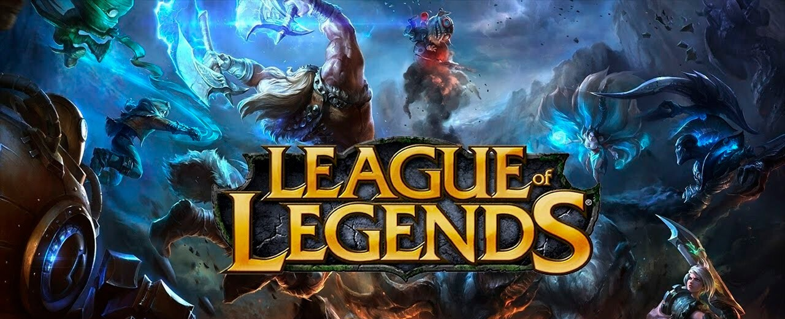

# Guía Completa de Jungla - League of Legends

Página web que funciona como guía completa para dominar el rol de Jungla en League of Legends. Está basada en métodos de un jugador challenger profesional y cubre desde los principios básicos hasta el control de objetivos y visión del mapa. Ideal para principiantes!

## Capturas del proyecto

## Tecnologías utilizadas

- HTML5
- CSS3 (Flexbox, Grid, animaciones, media queries)
- Google Fonts (Cinzel + Open Sans)

## Mejoras visuales incorporadas

- Paleta de colores temática de League of Legends (azul oscuro y dorado)
- Tipografía personalizada importada desde Google Fonts
- Variables CSS con `:root` para colores, fuentes y efectos reutilizables
- Layout con Flexbox en el menú de navegación y en las secciones con imagen + texto
- Grid CSS para los bloques de consejos dentro de cada sección
- Tarjetas con `border-radius`, `box-shadow` y efecto hover con `transform`
- Animación `@keyframes` de brillo pulsante en el título principal
- Animación `@keyframes` de fadeIn al cargar cada sección
- Transiciones suaves en botones, enlaces y tarjetas
- Diseño responsive con media queries para tablet (768px) y celular (480px)
- Menú que se reorganiza verticalmente en pantallas pequeñas

## Contenido

- Menú de navegación principal con enlaces internos hacia las diferentes secciones de la página
- Sección de principios básicos del rol de jungla
- Sección sobre por dónde empezar en la jungla (Blue o Red)
- Sección de campeones recomendados y builds según tipo de daño
- Tabla comparativa de items según daño físico, mágico o tanque
- Sección de zona de objetivos y cómo asegurarlos
- Sección de conocimiento del mapa y uso de wards
- Video demostrativo del mejor jungla de europa
- Formulario de contacto para dejar nickname, email y experiencia
